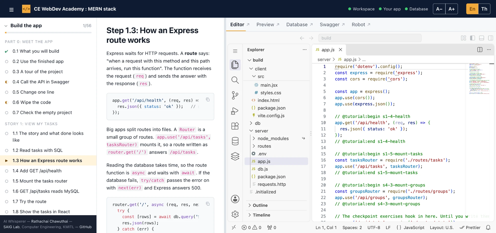

# CE WebDev Academy : MERN stack

An interactive course that runs on your own computer. Read the lesson on the left, write real code in **VS Code in the browser** on the right, and use the live preview, a database viewer, Swagger and automatic checks to see if your work is right. You build a **Task Manager** (React, Express, MySQL), then style it, test it and automate its API tests. About 15 hours in total. Lessons are in English with Thai explanations.



## The four modules

| Module | What you do | Time |
|---|---|---|
| **Build the app** (`build`) | Build the Task Manager step by step in seven stories: an Express API on MySQL and a React front end | 6 h |
| **Tailwind CSS** (`style`) | Start from an unstyled page and style it with Tailwind 4: layout, look, hover and focus states, mobile and dark mode | 3 h |
| **Unit testing** (`unit`) | Write tests with Vitest and Testing Library for server logic and React components; your tests are checked by putting bugs into the code | 3 h |
| **API Automation Test** (robot) | Test the API with Robot Framework: status codes, data, errors, and a final check against deliberate bugs | 3 h |

Each module is independent, so you can take them in any order. Every checkpoint has two optional exercises.

## Set up

### 1. What you need
- **Git**, to download the project: <https://git-scm.com/downloads>
- **Docker with Docker Compose**: Docker Desktop on Mac and Windows (Compose is included), or Docker Engine plus the Compose plugin on Linux. Check with `docker --version` and `docker compose version`.
- About 4 GB of free memory, 6 GB of disk, and internet for the first run only (it downloads and builds the images). Nothing else to install: no Node.js, no MySQL.

### 2. Download and start
Open a terminal, go to the folder where you keep your projects, and run:

```bash
git clone https://github.com/cei-www/mern-play.git
cd mern-play
docker compose up -d --build
```

The first run takes a few minutes. Make sure Docker is running before you start.

### 3. Open the course
Open **<http://localhost:4000>** in your browser.

Stop with `docker compose down`. Your work is kept in Docker volumes and is still there after `docker compose up -d`. Other commands and troubleshooting are in the [guide](docs/GUIDE.md).

## What is on the screen

1. **Header**: the course title, three status dots (Workspace, API, Database: green means running; the API dot is red while your server is not running, which is normal when you are editing it), the font size buttons **A− / A+**, and the language switch **En | Th**. The menu button at the left hides the lesson list.
2. **Lesson list** (far left): every module and step with its progress (○ To Do, ◐ Doing, ✔ Done), saved in your browser. Click a module title to open or close it.
3. **Lesson** (left): the explanation of the current step. Code blocks have a copy button, and each step names the exact file and place to edit. At the end of a step you can run its check and mark the step To Do, Doing or Done.
4. **Work area** (right), with five tabs:
   - **Editor**: VS Code in the browser with the project of the current module. Use its Terminal for `tutorial check`, `npm test` and other commands.
   - **Preview**: your running app or API. Choose what to open from the menu (App, API, the Tailwind app, Reference API, Robot report) and type a path.
   - **Database**: Adminer, to look at the MySQL tables.
   - **Swagger**: try every API operation without writing code.
   - **Robot**: the editor for the `api` module (it starts in its own container, see the guide).
5. **Drag the divider** between the lesson and the work area to give either side more room.

## Credit
AI Whisperer — [Rathachai Chawuthai](https://rathachai.github.io/) — [SAIG Lab](https://github.com/SAIG-KMITL), Computer Engineering, KMITL — [GitHub](https://github.com/cei-www/mern-play).

Released under the MIT license (see [LICENSE](LICENSE)). To change the course or the platform, read [CONTRIBUTING.md](CONTRIBUTING.md).
